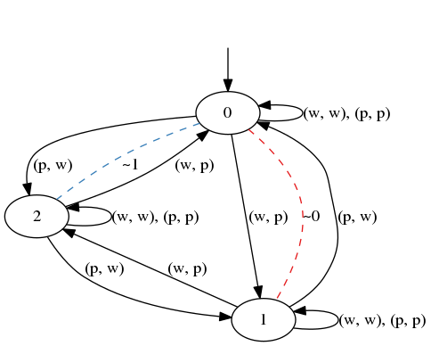

# Multiplayer Knowledge Based Subset Construct
We study a multiplayer version of the traditional KBSC and implement it in Python 3.

Authors: August Jacobsson & Helmer Nylén

Supervisor: Dilian Gurov

## Requirements
This library uses the following external programs, which need to be installed for the library to work.
- [NetworkX](https://networkx.github.io/), which can be installed via `pip3 install networkx`
- [pydot](https://github.com/erocarrera/pydot), which can be installed via `pip3 install pydot`
- [Graphviz](https://www.graphviz.org/), which can be downloaded from their website

## The `mkbsc` package
### Usage example - Wagon problem


An example of the code in `main.py` which applies the MKBSC to the two player triangular wagon problem.

```python
#!/usr/bin/env python3
from mkbsc import MultiplayerGame, export

#states
L = [0, 1, 2]
#initial state
L0 = 0
#action alphabet
Sigma = (("w", "p"), ("w", "p"))
#action labeled transitions
Delta = [
    (0, ("p", "p"), 0), (0, ("w", "w"), 0),
    (0, ("w", "p"), 1), (0, ("p", "w"), 2),
    (1, ("p", "p"), 1), (1, ("w", "w"), 1),
    (1, ("w", "p"), 2), (1, ("p", "w"), 0),
    (2, ("p", "p"), 2), (2, ("w", "w"), 2),
    (2, ("w", "p"), 0), (2, ("p", "w"), 1)
]
#observation partitioning
Obs = [
    [[0, 1], [2]],
    [[0, 2], [1]]
]

#G is a MultiplayerGame-object, and so are GK and GK0
G = MultiplayerGame.create(L, L0, Sigma, Delta, Obs)
GK = G.KBSC()
GK0 = GK.project(0)

#export the GK game to ./pictures/GK.png
export(GK, "GK")
```

### Behind the scenes
A brief summary is provided below. **For full documentation and a tutorial, please refer to the [user guide](mkbsc/README.md).**

The package contains definitions for a multiplayer game structure, `MultiplayerGame`. The states in the game are defined by `State`s, the transitions by `Transition`s and imperfect information is defined by an array of player-specific `Partitioning`s, which are sets of `Observation`s. The `State`s contain a tuple of each of the players' knowledge, which can be accessed by `State[player]`, where `player` is zero-indexed. When the first game is constructed it is sufficient to provide a single piece of knowledge for the states (usually an integer) which is considered to be the knowledge of all involved players.

### Projection
Multiplayer game structures can be projected to study how an individual player experiences the game. `MultiplayerGame.project(player)` project the game onto player `player`.

### KBSC
The KBSC is defined for both multi- and singleplayer games. Calling `MultiplayerGame.KBSC()` will yield a new `MultiplayerGame`. The knowledges in the states of the new game are sets of the states from the previous graph. This means that when iterating the construct (i.e. `MultiplayerGame.KBSC().KBSC()`...) the knowledge in the states of the resulting graph will form a sort of tree, where the leaves are the states of the original graph.

### Rendering
The games can be written in the DOT language by calling `MultiplayerGame.to_dot()`, and will by default color-code observations for each player. The DOT representation can be written to a file and compiled by the `dot` command in Graphviz. This is all done automatically by calling `mkbsc.export(game, filename)`, which saves and opens a PNG image.

### Isomorphism
The isomorphism of two game graphs can be checked by calling `MultiplayerGame.isomorphic(MultiplayerGame)`. The function can optionally also take the observations of each player into account.

### Saving games
Games can be saved to disk with the function `mkbsc.to_file(game, filename)`, and loaded with `game = mkbsc.from_file(filename)`. For larger games, it is recommended to skip the validation when loading the game by passing the flag `validate=False`.
